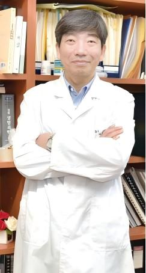

:::: {.hero .reveal}
<h1>Welcome to Yong-Yeon Cho’s Lab</h1>

<p class="subtitle">

We are dedicated to deciphering the core mechanisms of karyoptosis, striving to translate fundamental biological discoveries into breakthrough disease therapies and novel targets for drug development.

</p>

::: hero-video-wrap
<video class="hero-video" autoplay muted loop playsinline controls> <source src="videos/karyoptosis-live-imaging.mp4" type="video/mp4"> </video>
:::
::::

::: {.section-block .reveal}
## About the Lab

Our laboratory has long been engaged in research on cancer signal transduction, protein stability regulation, and regulated cell death. In recent years, we have increasingly focused on uncovering the molecular mechanisms underlying **karyoptosis**, with the goal of advancing disease research and therapeutic development.

We have systematically elucidated the roles of signaling networks involving RSK2, FBXW7, STAT2, ERK3, and ELK3 in cancer cell proliferation, transformation, and therapeutic resistance. At the same time, we have established and advanced a distinctive research framework centered on nuclear envelope homeostasis and aberrant cleavage of CREB3, which has led to new insights into the mechanism of karyoptosis.

Furthermore, our work continues to expand into innate immune and inflammatory pathways, including NLRP3, cGAS/STING, and necroptosis, as well as natural product pharmacology, drug metabolism, and translational toxicology. Together, these efforts define a research profile that integrates fundamental molecular mechanisms with pharmaceutical applications.
:::

::::: {.pi-section .reveal}
::: pi-photo

:::

::: pi-info
## Prof. Yong-Yeon Cho

**Professor, College of Pharmacy, The Catholic University of Korea**

Professor Yong-Yeon Cho is a professor in the Laboratory of Pharmaceutical Biochemistry at the College of Pharmacy, The Catholic University of Korea. He has also served as Dean of the College of Pharmacy, as well as Director of the Integrated Research Institute of Pharmaceutical Sciences and the Research Institute for RCD·Materials at the same university.

Professor Cho completed his postdoctoral training at the Hormel Institute, University of Minnesota, USA, where he later served as a Research Assistant Professor. Since joining The Catholic University of Korea in 2011, he has led research in cancer development, signaling networks, protein stability regulation, and regulated cell death.

His work has particularly focused on **protein stability regulation** and **karyoptosis**, a newly identified form of regulated cell death further developed through his group’s research. His studies have been widely recognized internationally and have contributed substantially to the understanding of cancer signaling, nuclear membrane biology, and disease-related molecular mechanisms.
:::
:::::

:::::: {.section-block .reveal}
## Education and Professional Experience

::::: cv-grid
::: cv-card
### Educational Experience

-   **1991** — Bachelor, Department of Biology, Chungnam National University, Korea\
-   **1993** — Master, Department of Biology, Graduate School of Chungnam National University, Korea\
-   **2000** — Ph.D., Tohoku University, Japan
:::

::: cv-card
### Professional Experience

-   **1991.01–1994.05** — Scientist, KRIBB\
-   **1994.06–2001.12** — Scientist, KFDA\
-   **2001.12–2005.05** — Postdoctoral Fellow, Hormel Institute, University of Minnesota\
-   **2005.06–2011.01** — Research Assistant Professor, Hormel Institute, University of Minnesota\
-   **2011.02–present** — Assistant, Associate, and Full Professor, College of Pharmacy, The Catholic University of Korea\
-   **2015.03–2018.02** — Dean, College of Pharmacy, The Catholic University of Korea\
-   **2022.02–2025.04** — Director, Integrated Research Institute of Pharmaceutical Sciences, The Catholic University of Korea\
-   **2022.09–2024.12** — Director, Research Institute for RCD·Materials
:::
:::::
::::::

:::: {.section-block .reveal}
## Research Interests

::: interests
[Nuclear membrane biology]{.interest-tag} [Stress-responsive transcription factors]{.interest-tag} [Regulated intramembrane proteolysis]{.interest-tag} [Structural and computational biology]{.interest-tag} [Karyoptosis]{.interest-tag} [Protein stability]{.interest-tag}
:::
::::

:::: {.section-block .reveal}
## News

::: news-box
Our lab website is currently under construction.\
Updates on new projects, publications, and lab activities will be posted here soon.
:::
::::

::: home-note
Exploring molecular mechanisms from fundamental biology to translational application.
:::

\`\`\`{=html}

```{=html}
<script>
document.addEventListener("DOMContentLoaded", function () {
  const elements = document.querySelectorAll(".reveal");
  const observer = new IntersectionObserver((entries) => {
    entries.forEach((entry) => {
      if (entry.isIntersecting) {
        entry.target.classList.add("visible");
      }
    });
  }, { threshold: 0.12 });

  elements.forEach((el) => observer.observe(el));
});
</script>
```
