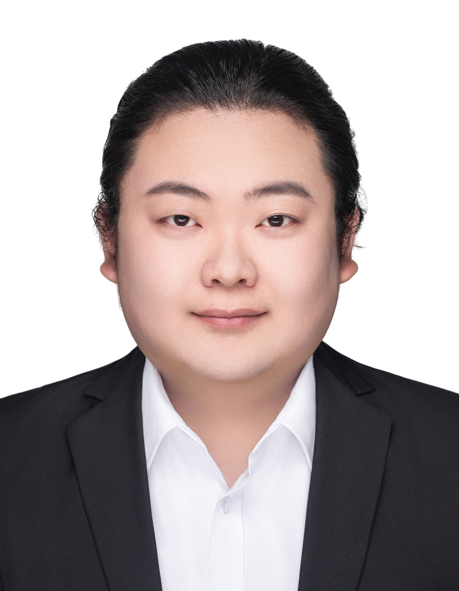

# Principal Investigator

::::: pi-section
::: pi-photo
{alt="Prof. Yong-Yeon Cho"}
:::

::: pi-info
## Prof. Yong-Yeon Cho

**Professor, College of Pharmacy, The Catholic University of Korea**

Professor Yong-Yeon Cho is a professor in the Laboratory of pharmaceutical Biochemistry at the College of Pharmacy, The Catholic University of Korea. He has also served as Dean of the College of Pharmacy and Directors of the Integrated Research Institute of Pharmaceutical Sciences and the Research Institute for RCD· Materials at the same University. Professor Cho completed his postdoctoral fellowship and later served as a research assistant professor at the Hormel Institute, University of Minnesota, USA. Since joining the College of Pharmacy at The Catholic University of Korea in 2011, he has been conducting research on cancer development and signaling networks. His work particularly focuses on “protein stability regulation” and on “karyoptosis”, a newly identified form of regulated cell death first characterized by his research group. Recognized as a top 1% researcher worldwide, Professor Cho has consistently published in leading international journals. His publications have been cited more than 20,000 times, and he has accumulated a total impact factor exceeding 1,000, underscoring his global reputation and influence in the scientific community.

### Academic Positions

-   (2015–2020) College of Pharmacy, The Catholic University of Korea, Associate Professor
-   (2020–present) College of Pharmacy, The Catholic University of Korea, Professor
-   (2016–2018) Integrative Research Institute Pharmaceutical Sciences, The Catholic University of Korea, Director
-   (2022–present) College of Pharmacy, The Catholic University of Korea, Dean

### Research Interests

-   Protein Stability Regulation by Ubiquitination
-   Regulated Cell Death (RCD)
-   Cancer Development and Carcinogenesis
-   Chemoresistance
-   Karyoptosis

**Email:** [yongyeon\@catholic.ac.kr](mailto:your_email@catholic.ac.kr)
:::
:::::

# Graduate Students

:::::: student-grid
::: student-card
{.student-photo alt="Xianzhe Li"}

### Xianzhe Li

[a111lixianzhe\@gmail.com](mailto:a111lixianzhe@gmail.com)
:::

::: student-card
{.student-photo alt="Student B"}

### Student B

[studentb\@email.com](mailto:studentb@email.com)
:::

::: student-card
{.student-photo alt="Student C"}

### Student C

[studentc\@email.com](mailto:studentc@email.com)
:::
::::::
