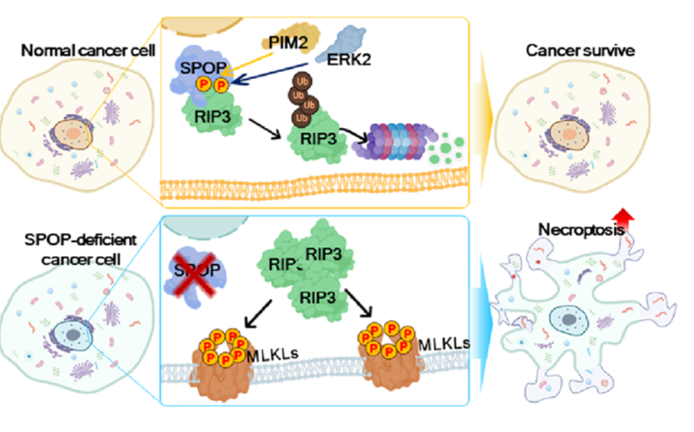
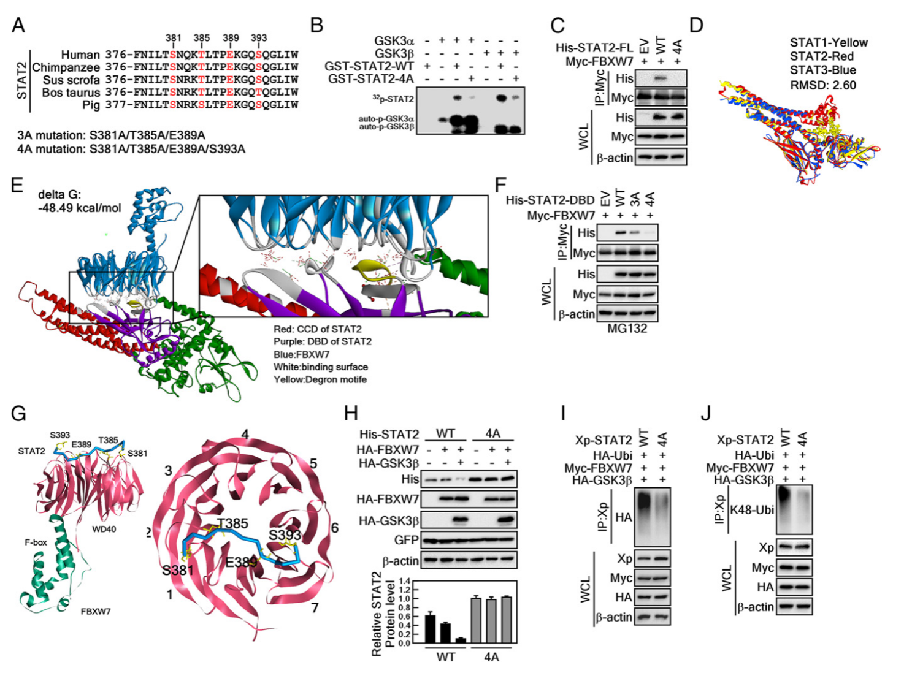
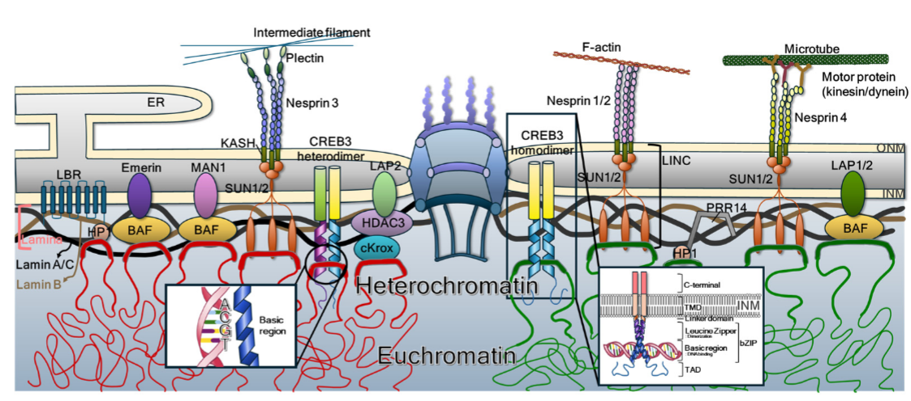
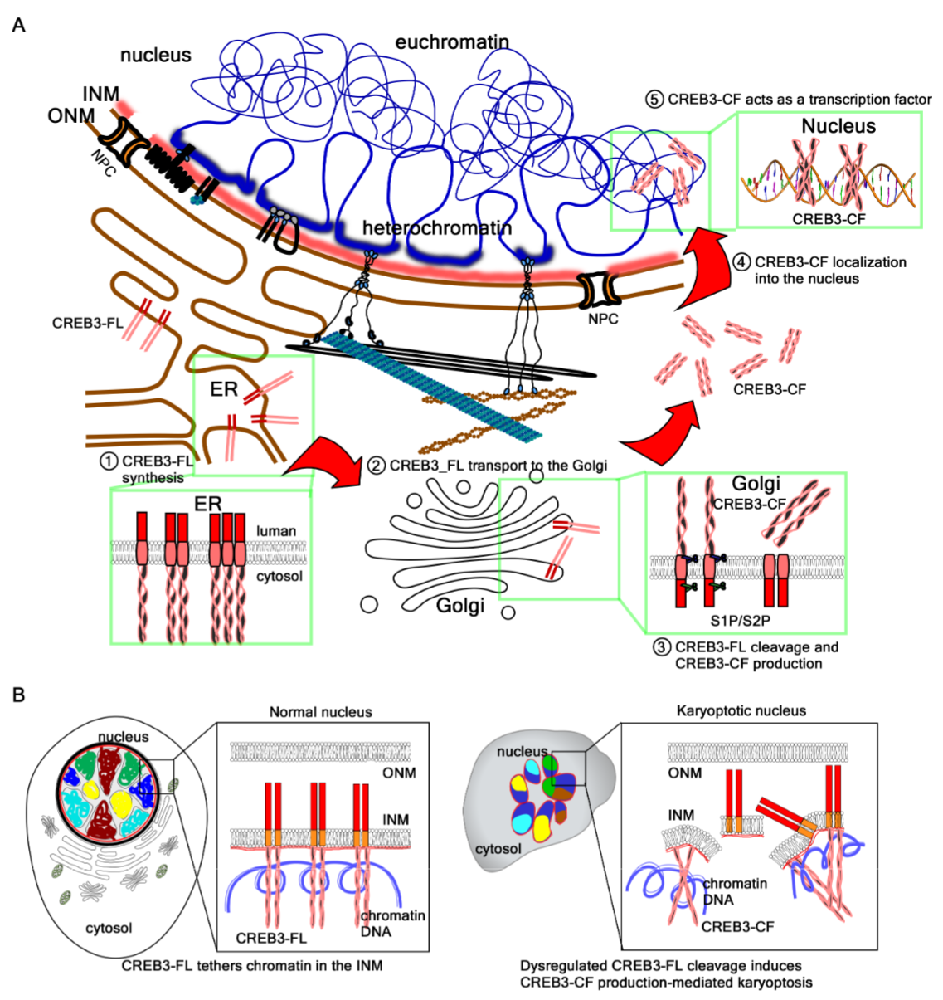
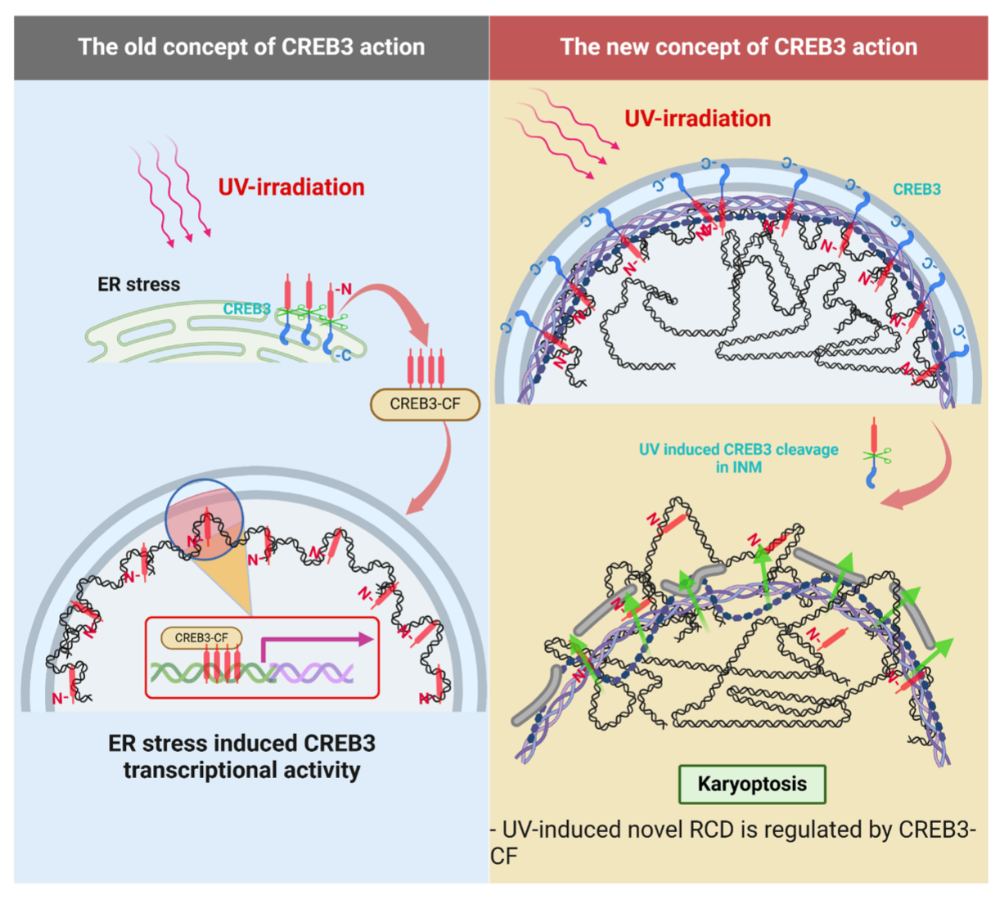
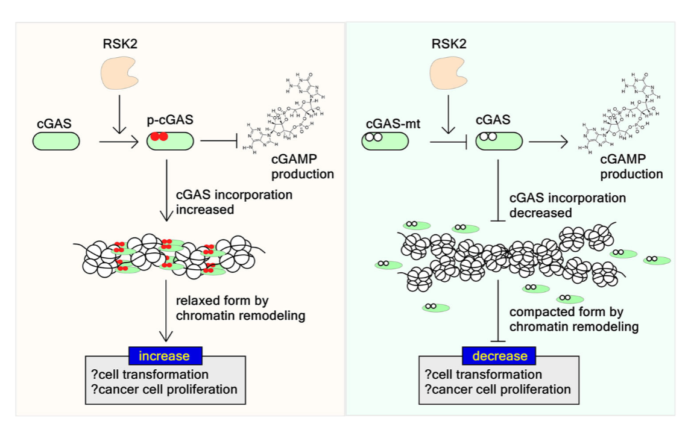
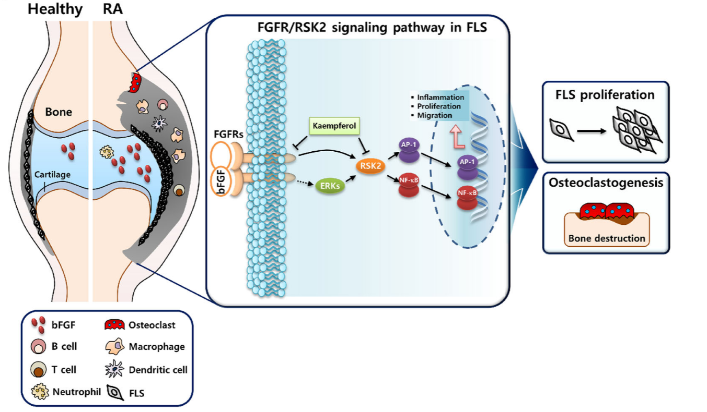

```{=html}
<style>
.research-gallery {
  display: grid;
  grid-template-columns: repeat(auto-fit, minmax(260px, 1fr));
  gap: 16px;
  margin: 16px 0 28px 0;
}

.research-gallery img {
  width: 100%;
  border-radius: 10px;
  display: block;
}

.research-gallery.single {
  grid-template-columns: minmax(260px, 520px);
}
</style>
```

# Research

## Cancer signal transduction and regulation of protein stability

Research in our laboratory continues to focus on key signaling nodes such as RSK2, ERK, ELK3, FBXW7, STAT2, ERK3, and E2Fs. The central question is how kinase networks, protein–protein interactions, ubiquitination, and protein stability regulation contribute to cancer cell proliferation, transformation, and drug resistance. Representative studies include RSK2–ELK3 promoting breast cancer growth; FBXW7-mediated regulation of STAT2 influencing melanoma development; FBXW7-mediated control of ERK3 suppressing lung cancer cell proliferation; MEKs/ERKs–FBXO1/E2Fs regulating the G1/S transition; the AKT–RSK2 axis promoting cancer cell proliferation; and a 2025 review on the roles of RSK2 and its interacting partners in cancer.

::: research-gallery
 
:::

## Nuclear envelope homeostasis, CREB3, and a novel form of regulated cell death termed karyoptosis

This has become one of the most prominent research directions of our group in recent years. Karyoptosis was first identified by our laboratory as a novel form of regulated cell death. More recently, this field has advanced toward elucidating the molecular mechanisms linking nuclear envelope integrity and aberrant CREB3 cleavage. Representative publications include a 2023 review on the regulation of nuclear envelope integrity, the 2024 paper *“Dysregulated CREB3 cleavage at the nuclear membrane induces karyoptosis-mediated cell death,”* and *“Karyoptosis as a novel type of UVB-induced regulated cell death.”* In 2025, this research was further extended to reveal new roles of membrane-bound bZIP transcription factors in chromatin anchoring and karyoptosis.

::: research-gallery
  
:::

## Innate immunity and inflammatory signaling: NLRP3, cGAS/STING, and necroptosis

Our team has long focused on the intersection of inflammasomes and innate immunity. From 2018 to 2021, we conducted a series of studies on NLRP3, covering acute gout, suppression of metastasis within the tumor microenvironment, and modulation of inflammasomes through small molecules or post-translational modifications. Subsequently, our research expanded into cGAS/STING and necroptosis. A comprehensive review on cGAS/STING was published in 2023, and in 2024 we reported that RSK2 mediates cGAS phosphorylation to promote cellular transformation. In addition, our work on SPOP–RIPK3 elucidated regulatory mechanisms underlying necroptotic cell death. Thus, our focus extends beyond inflammation itself to the integration of innate immune signaling with tumorigenesis and cell fate determination.

::: {.research-gallery .single}

:::

## Pharmaceutical translational research: natural products, drug metabolism, toxicology, and delivery

We also pursue pharmaceutical translational research, primarily encompassing three major areas. First, we investigate the anticancer and anti-inflammatory mechanisms of natural products and bioactive compounds, such as kaempferol and fargesin. Second, we study metabolic profiling of drugs and natural products in hepatocytes, cross-species metabolic comparisons, and drug–drug interactions, including work on fargesin, aschantin, and eudesmin. Third, we explore toxicokinetics and delivery systems, such as in vivo distribution studies of phalloidin and delivery-related strategies involving DNA nanostructures and exosomes.

::: {.research-gallery .single}

:::
